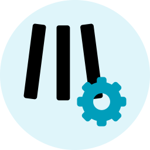
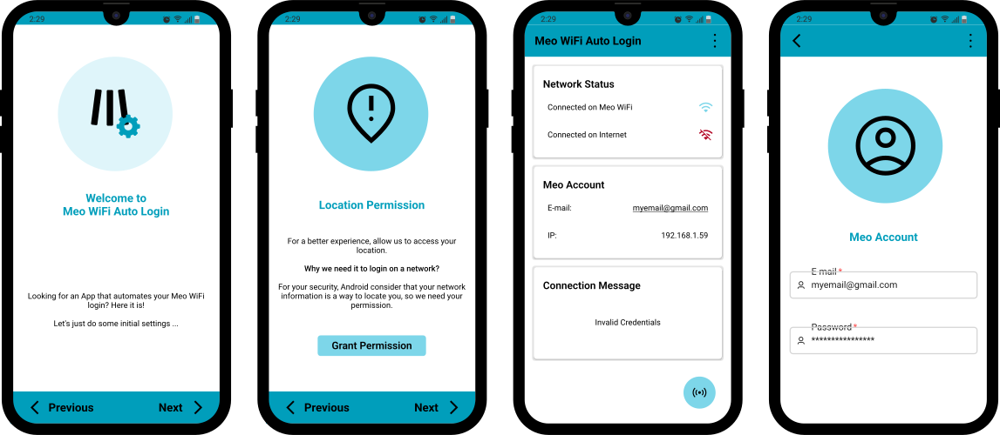

<h1 align="center">
	<a href="https://github.com/Darguima/meo-wifi-auto-login">
		
	</a>
</h1>

<h2 align="center">
	Meo WiFi Auto Login
</h2>

<p align="center">
Meo WiFi Auto Login is a project where you can automatically login to the Meo WiFi Hotspots, bypassing the annoying official Captive Portal. This project is also an open-source project so is possible anyone help since reporting bugs, writing code, documentation, giving ideas or just checking the <a href="https://www.github.com/Darguima/meo-wifi-auto-login">homepage</a>.
</p>

<h4 align="center">
⭐ Don't forget to Starring ⭐
</h4>

<h1 align="center">
		
</h1>

<br/>

## Table of Contents 🗃️

- [Download & Installation](#download--installation-)
- [How it works?](#how-it-works-)
- [Getting Started](#getting-started-)
- [Technologies Used](#technologies-used-)
- [Disclaimer](#-disclaimer-)
- [License](#license-%EF%B8%8F)

## Download & Installation 📥📲

You can download this App in the Releases or build the code with some changes that you may want.

* [Download APK](https://github.com/Darguima/meo-wifi-auto-login/releases)
* [Download and Build the Code](#getting-started-)

## How it works? ⚙⚙

After installing the app, you will be guided through the initial setup. When finished, just be connected to a Meo WiFi Hotspot and press the button. The App will do the rest to connect you to the Internet.
In the future, we want the app to be able to automatically connect you in the background.

Meo WiFi Auto Login is a GUI interface for my package [`meo-wifi-login-js`](https://github.com/Darguima/meo-wifi-login-js).

## Getting Started 🚀

### Prerequisites

- `Git` to clone the repository;

- `Yarn` to install dependencies;

- For run the project you will need the `React Native` Environment configured. You can follow the [ReactNative Official Documentation](https://reactnative.dev/docs/environment-setup#development-os);

###### Note: This project was only tested and developed for Android, so I don't know if it works properly in IOS. Is recommended that you run it in an `Android Phone`;

##### Cloning

```bash
$ git clone https://github.com/Darguima/meo-wifi-auto-login.git
$ git clone git@github.com:Darguima/meo-wifi-auto-login.git
```

##### Installing Dependencies

```bash
$ yarn
```

### Setup 🛠️

- To setup the application you can use:

```bash
yarn start
yarn android
```

At this moment you should have a Android Emulator running.

### Building the APK

#### Generate a KeyStore 🔑

Fill in the required inputs (and remember the password):

```bash
$ keytool -genkey -v -keystore android/app/meo_wifi_auto_login.keystore -alias meo_wifi_auto_login -keyalg RSA -keysize 2048 -validity 10000
```

#### Edit the gradle ✏️

Edit the file `android/app/build.gradle`, changing `storePassword` and `keyPassword` to the previous password.

#### Assemble 🧑‍🏭

```bash
cd android
./gradlew assembleRelease
```

###### Based on [this](https://instamobile.io/android-development/generate-react-native-release-build-android/) tutorial.

___

## Technologies Used 💻

- core ⚛
	- JavaScript/TypeScript
	- React Native

- packages 📦
	- [meo-wifi-login](https://github.com/Darguima/meo-wifi-login-js) - my package to login to Meo WiFi Captive Portal
	- [react-native-paper](https://reactnativepaper.com/) - to create the UI
	- [Async Storage](https://github.com/react-native-async-storage/async-storage) - to save data as settings and histories
	- [react-native-keychain](https://github.com/oblador/react-native-keychain) - to save users' Meo credentials
	- [netinfo](https://github.com/react-native-netinfo/react-native-netinfo) - to detect the status of the network

---

## 🚨 Disclaimer 🚨

This is not an official app from Meo Altice.

## License 👨🏾‍⚖️
This project is licensed under the MIT License - see the [LICENSE](../LICENSE) file for details.
