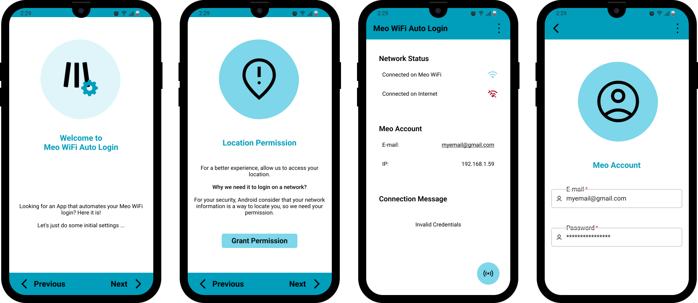

<!-- PROJECT LOGO -->
<br />
<div align="center">
  <a href="https://github.com/darguima/meo-wifi-auto-login">
    
  </a>

  <h3 align="center">Meo WiFi Auto Login</h3>

  <p align="center">
    Meo WiFi Access Fully Automated 
    <br />
    <br />
    <a href="#-demo">View Demo</a>
    &middot;
    <a href="#️-download--installation">Download Project</a>
    &middot;
    <a href="#-getting-started-with-development">Start Developing</a>
  </p>

<h4 align="center">
⭐ Don't forget to Starring ⭐
</h4>

  <div align="center">

[![TypeScript][TypeScript-badge]][TypeScript-url]
[![ReactNative][ReactNative-badge]][ReactNative-url]

  </div>
  
  <p align="center">
    
  </p>
</div>


<!-- TABLE OF CONTENTS -->
<details>
  <summary>📋 Table of Contents</summary>

## 📋 Table of Contents

- [About The Project](#-about-the-project)
- [Download & Installation](#️-download--installation)
- [Getting Started with Development](#-getting-started-with-development)
- [Contributing](#-contributing)
- [Developed by](#-developed-by)
</details>


## 🔍 About The Project

### 🎯 The Goal

Meo WiFi hotspots are widely available across Portugal, but accessing them requires navigating through a cumbersome captive portal every single time you connect. My goal was to automatize all this process on an app that pretended to automatically connect the phone when a Hotspot was detected.

### ⚙️ How It Works

Meo WiFi Auto Login eliminates this friction by automating the entire authentication process. Built as a GUI interface for my [`meo-wifi-login-js`](https://github.com/Darguima/meo-wifi-login-js) library, the application handles all the behind-the-scenes communication with MEO's captive portal system.

After the initial setup, connecting becomes effortless: simply ensure you're connected to a MEO WiFi hotspot and press the login button. The app automatically handles the authentication protocol, bypassing the captive portal interface entirely and establishing your internet connection without any manual intervention.

Future development aims to implement full background automation, where the app will detect MEO hotspots and authenticate automatically without any user interaction required.

### 🎬 Demo

https://user-images.githubusercontent.com/49988070/197389295-128bf269-2bce-4e5b-a520-05e3531c7902.mp4


## ⬇️ Download & Installation

You can download this App in the Releases or build the code with some changes that you may want.

* [Download APK](https://github.com/Darguima/meo-wifi-auto-login/releases)
* [Download and Build the Code](#getting-started-)


## 🚀 Getting Started with Development

To get a local copy up and running follow these simple example steps.

### 1. Prerequisites

Start by installing the following tools:

* [Git](https://git-scm.com/downloads) - Version Control System

* [Yarn](https://yarnpkg.com/getting-started/install) - Package Manager

* For run the project you will need the `React Native` Environment configured. You can follow the [ReactNative Official Documentation](https://reactnative.dev/docs/environment-setup#development-os);

###### Note: This project was only tested and developed for Android, so I don't know if it works properly in IOS. Is recommended that you run it in an `Android Phone`;

### 2. Cloning

Now clone the repository to your local machine. You can do this using Git:

```bash
$ git clone https://github.com/Darguima/meo-wifi-auto-login.git
# or
$ git clone git@github.com:Darguima/meo-wifi-auto-login.git
```

### 3. Dependencies

Install the dependencies using Yarn:

```bash
$ yarn
```

### 4. Setup 🛠️

- To setup the application you can use:

```bash
yarn start
yarn android
```

At this moment you should have a Android Emulator running

### 5. Building the APK

#### Generate a KeyStore 🔑

Fill in the required inputs (and remember the password):

```bash
$ keytool -genkey -v -keystore android/app/meo_wifi_auto_login.keystore -alias meo_wifi_auto_login -keyalg RSA -keysize 2048 -validity 10000
```

#### Edit the gradle ✏️

Edit the file `android/app/build.gradle`, changing `storePassword` and `keyPassword` to the previous password.

#### Assemble 🧑‍🏭

```bash
cd android
./gradlew assembleRelease
```

###### Based on [this](https://instamobile.io/android-development/generate-react-native-release-build-android/) tutorial.

## 🤝 Contributing

Contributions are what make the open source community such an amazing place to learn, inspire, and create. Any contributions you make are **greatly appreciated**.

If you have a suggestion that would make this better, please fork the repo and create a pull request. You can also simply open an issue with the tag "enhancement".
Don't forget to give the project a star! Thanks again!

1. Fork the Project
2. Create your Feature Branch (`git checkout -b feature/AmazingFeature`)
3. Commit your Changes (`git commit -m 'Add some AmazingFeature'`)
4. Push to the Branch (`git push origin feature/AmazingFeature`)
5. Open a Pull Request


## 👨‍💻 Developed by

- [Darguima](https://github.com/darguima)


<!-- MARKDOWN LINKS & IMAGES -->
<!-- https://www.markdownguide.org/basic-syntax/#reference-style-links -->
[project-thumbnail]: ./assets/logo_rounded.svg

[TypeScript-badge]: https://img.shields.io/badge/TypeScript-3178C6?style=for-the-badge&logo=typescript&logoColor=white
[TypeScript-url]: https://www.typescriptlang.org

[ReactNative-badge]: https://img.shields.io/badge/React%20Native-20232A?style=for-the-badge&logo=react&logoColor=61DAFB
[ReactNative-url]: https://reactnative.dev
